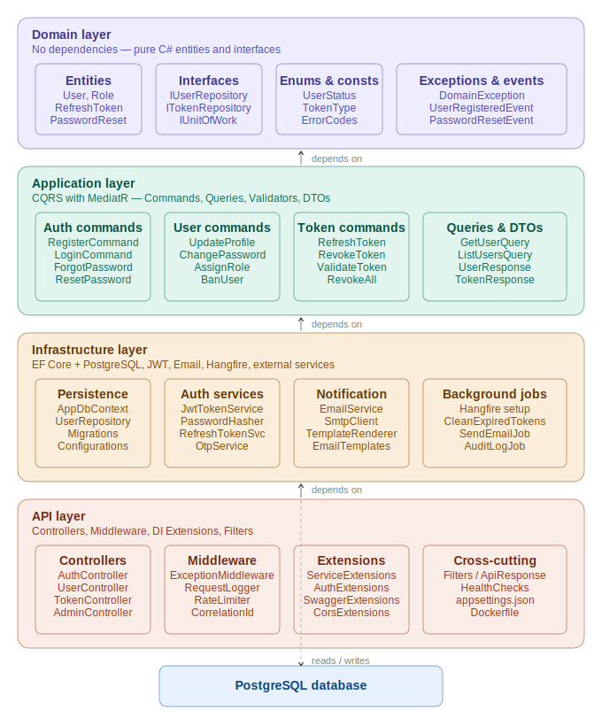

# AuthCore.API

A production-ready **User Authentication & Management Microservice** built with .NET Core 8 and PostgreSQL, designed to be integrated into a microservices architecture. Handles everything from user registration and login to role-based access control, profile management, and token lifecycle.

---

## Table of Contents

- [Overview](#overview)
- [Architecture](#architecture)
- [Features](#features)
- [Tech Stack](#tech-stack)
- [Project Structure](#project-structure)
- [Getting Started](#getting-started)
  - [Prerequisites](#prerequisites)
  - [Run with Docker](#run-with-docker)
  - [Run Locally](#run-locally)
- [Configuration](#configuration)
- [API Endpoints](#api-endpoints)
- [Authentication Flow](#authentication-flow)
- [Database Migrations](#database-migrations)
- [Background Jobs](#background-jobs)
- [Testing](#testing)
- [Integration with Other Services](#integration-with-other-services)
- [Roadmap](#roadmap)

---

## Overview

AuthCore.API is a standalone, containerized microservice responsible for all identity concerns in your platform. It issues and validates JWT access tokens, manages refresh token rotation, handles password recovery via email OTP, and exposes admin endpoints for user and role management.

Other microservices in your system verify tokens issued by AuthCore without calling back into it — keeping the auth flow stateless and fast.

---

## Architecture

AuthCore.API follows **Clean Architecture** with strict layer separation:


**Key patterns used:**
- CQRS with MediatR — commands and queries are fully separated
- Repository + Unit of Work — infrastructure details are hidden behind interfaces
- Pipeline behaviours — validation, logging, and performance monitoring applied cross-cutting
- Domain events — `UserRegisteredEvent`, `PasswordResetRequestedEvent` are raised inside aggregates and can be published to a message broker for other services to consume

---

## Features

### Authentication
- User registration with email verification
- Login with JWT access token + refresh token pair
- Forgot password — sends a reset link via email
- Reset password with OTP/token validation
- Refresh token rotation (old token invalidated on each refresh)
- Logout with single-token or all-device token revocation

### Profile Management
- View and update profile (name, avatar)
- Change password (requires current password)
- Upload avatar
- Delete account (soft delete)

### Admin Panel
- List all users with pagination and filtering
- View detailed user profile
- Assign and revoke roles
- Ban and unban users
- View active sessions per user

### Token Management
- List active refresh tokens per user
- Revoke a specific token
- Revoke all tokens for a user (force logout everywhere)
- Automatic cleanup of expired tokens via background job

---

## Tech Stack

| Concern | Technology |
|---|---|
| Framework | .NET Core 8 (ASP.NET Web API) |
| Database | PostgreSQL 16 |
| ORM | Entity Framework Core 8 + Npgsql |
| CQRS | MediatR |
| Validation | FluentValidation |
| Mapping | AutoMapper |
| Authentication | JWT Bearer + Refresh Tokens |
| Password Hashing | BCrypt (via ASP.NET Core Identity) |
| Email | MailKit (SMTP) |
| Background Jobs | Hangfire + Hangfire.PostgreSql |
| Logging | Serilog (console + PostgreSQL sink) |
| API Docs | Swagger / Swashbuckle |
| Rate Limiting | AspNetCoreRateLimit |
| Containerisation | Docker + Docker Compose |
| Testing | xUnit + Moq + FluentAssertions + Testcontainers |

---

## Project Structure

```
AuthCore.API/
├── src/
│   ├── AuthCore.Domain/
│   │   ├── Entities/          # User, Role, UserRole, RefreshToken, PasswordResetToken
│   │   ├── Interfaces/        # IUserRepository, IRoleRepository, ITokenRepository, IUnitOfWork
│   │   ├── Enums/             # UserStatus, TokenType
│   │   ├── Exceptions/        # DomainException, NotFoundException, UnauthorizedException
│   │   ├── Events/            # UserRegisteredEvent, PasswordResetRequestedEvent
│   │   └── Common/            # BaseEntity, ErrorCodes
│   │
│   ├── AuthCore.Application/
│   │   ├── Features/
│   │   │   ├── Auth/          # Register, Login, ForgotPassword, ResetPassword
│   │   │   ├── Users/         # UpdateProfile, ChangePassword, UploadAvatar, DeleteAccount
│   │   │   ├── Admin/         # AssignRole, BanUser, ListUsers, GetUserDetails
│   │   │   └── Tokens/        # RefreshToken, RevokeToken, RevokeAllTokens, GetActiveTokens
│   │   ├── DTOs/              # AuthResponse, TokenResponse, UserResponse
│   │   ├── Interfaces/        # IJwtService, IEmailService, IPasswordHasher, IOtpService
│   │   ├── Behaviours/        # ValidationBehaviour, LoggingBehaviour, PerformanceBehaviour
│   │   └── DependencyInjection.cs
│   │
│   ├── AuthCore.Infrastructure/
│   │   ├── Persistence/       # AppDbContext, Repositories, EF Configurations, Migrations
│   │   ├── Services/          # JwtTokenService, RefreshTokenService, PasswordHasher, OtpService
│   │   ├── Email/             # EmailService, HTML templates (Welcome, PasswordReset)
│   │   ├── BackgroundJobs/    # CleanExpiredTokensJob, SendEmailJob
│   │   └── DependencyInjection.cs
│   │
│   └── AuthCore.API/
│       ├── Controllers/       # AuthController, UsersController, TokensController, AdminController
│       ├── Middleware/        # ExceptionMiddleware, RequestLoggingMiddleware, CorrelationIdMiddleware
│       ├── Filters/           # ValidationFilter
│       ├── Extensions/        # ServiceCollectionExtensions, AuthExtensions, SwaggerExtensions
│       ├── Models/            # ApiResponse<T>
│       ├── appsettings.json
│       ├── Program.cs
│       └── Dockerfile
│
├── tests/
│   ├── AuthCore.UnitTests/        # Handler and validator unit tests
│   └── AuthCore.IntegrationTests/ # Full API tests with Testcontainers
│
├── docker-compose.yml
├── docker-compose.override.yml
└── AuthCore.sln
```

---

## Getting Started

### Prerequisites

- [.NET 8 SDK](https://dotnet.microsoft.com/download/dotnet/8.0)
- [Docker Desktop](https://www.docker.com/products/docker-desktop/)
- [dotnet-ef CLI tools](https://learn.microsoft.com/en-us/ef/core/cli/dotnet)

```bash
dotnet tool install --global dotnet-ef
```

### Run with Docker

The fastest way to get everything running — API + PostgreSQL with a single command:

```bash
git clone https://github.com/your-org/AuthCore.API.git
cd AuthCore.API

docker-compose up --build
```

The API will be available at `http://localhost:5001` and Swagger at `http://localhost:5001/swagger`.

The Hangfire dashboard is available at `http://localhost:5001/jobs`.

### Run Locally

**1. Start PostgreSQL** (or use the Docker Compose database only):

```bash
docker-compose up postgres -d
```

**2. Update connection string** in `src/AuthCore.API/appsettings.Development.json`:

```json
{
  "ConnectionStrings": {
    "DefaultConnection": "Host=localhost;Port=5432;Database=authcore;Username=postgres;Password=postgres"
  }
}
```

**3. Apply migrations:**

```bash
dotnet ef database update \
  --project src/AuthCore.Infrastructure \
  --startup-project src/AuthCore.API
```

**4. Run the API:**

```bash
dotnet run --project src/AuthCore.API
```

---

## Configuration

All configuration is in `appsettings.json`. Override values per environment using `appsettings.{Environment}.json` or environment variables (recommended for production secrets).

```json
{
  "ConnectionStrings": {
    "DefaultConnection": "Host=localhost;Port=5432;Database=authcore;Username=postgres;Password=yourpassword"
  },
  "JwtSettings": {
    "SecretKey": "your-super-secret-key-minimum-32-characters",
    "Issuer": "AuthCore.API",
    "Audience": "AuthCore.Clients",
    "AccessTokenExpiryMinutes": 15,
    "RefreshTokenExpiryDays": 7
  },
  "EmailSettings": {
    "SmtpHost": "smtp.yourprovider.com",
    "SmtpPort": 587,
    "FromEmail": "noreply@yourapp.com",
    "FromName": "AuthCore"
  },
  "RateLimiting": {
    "EnableEndpointRateLimiting": true,
    "StackBlockedRequests": false,
    "GeneralRules": [
      {
        "Endpoint": "*",
        "Period": "1m",
        "Limit": 60
      },
      {
        "Endpoint": "*/auth/login",
        "Period": "5m",
        "Limit": 10
      }
    ]
  }
}
```

> **Never commit real secrets.** Use environment variables, Azure Key Vault, AWS Secrets Manager, or Docker secrets in production.

---

## API Endpoints

All endpoints return a consistent envelope:

```json
{
  "success": true,
  "data": { },
  "message": "string",
  "errors": []
}
```

### Auth — `/api/v1/auth`

| Method | Endpoint | Auth | Description |
|---|---|---|---|
| `POST` | `/register` | Public | Create a new user account |
| `POST` | `/login` | Public | Login and receive access + refresh tokens |
| `POST` | `/forgot-password` | Public | Send password reset email |
| `POST` | `/reset-password` | Public | Reset password using OTP token |
| `POST` | `/verify-email` | Public | Verify email address |

### Tokens — `/api/v1/tokens`

| Method | Endpoint | Auth | Description |
|---|---|---|---|
| `POST` | `/refresh` | Public | Exchange a refresh token for a new token pair |
| `POST` | `/revoke` | Bearer | Revoke the current refresh token |
| `POST` | `/revoke-all` | Bearer | Revoke all refresh tokens (logout everywhere) |
| `GET` | `/active` | Bearer | List all active sessions for the current user |

### Users — `/api/v1/users`

| Method | Endpoint | Auth | Description |
|---|---|---|---|
| `GET` | `/me` | Bearer | Get current user profile |
| `PUT` | `/me` | Bearer | Update profile (name, avatar) |
| `PUT` | `/me/password` | Bearer | Change password |
| `POST` | `/me/avatar` | Bearer | Upload avatar image |
| `DELETE` | `/me` | Bearer | Delete own account |

### Admin — `/api/v1/admin`

| Method | Endpoint | Auth | Description |
|---|---|---|---|
| `GET` | `/users` | Admin | List all users (paginated, filterable) |
| `GET` | `/users/{id}` | Admin | Get a specific user's full details |
| `POST` | `/users/{id}/roles` | Admin | Assign a role to a user |
| `DELETE` | `/users/{id}/roles/{role}` | Admin | Remove a role from a user |
| `POST` | `/users/{id}/ban` | Admin | Ban a user |
| `POST` | `/users/{id}/unban` | Admin | Unban a user |

---

## Authentication Flow

### Login & token refresh

```
Client                          AuthCore.API                    PostgreSQL
  │                                  │                               │
  │─── POST /auth/login ────────────►│                               │
  │                                  │──── Verify user + password ──►│
  │                                  │◄─── User record ──────────────│
  │◄── { accessToken, refreshToken }─│                               │
  │                                  │                               │
  │  (15 min later, access expires)  │                               │
  │                                  │                               │
  │─── POST /tokens/refresh ────────►│                               │
  │    { refreshToken }              │──── Validate + rotate ────────►│
  │                                  │◄─── New token stored ─────────│
  │◄── { new accessToken,           ─│                               │
  │      new refreshToken }          │                               │
```

### Token verification in other services

Other microservices **do not call AuthCore.API** to verify tokens. They validate the JWT signature locally using the shared public key or secret:

```csharp
// In any other .NET microservice
builder.Services.AddAuthentication(JwtBearerDefaults.AuthenticationScheme)
    .AddJwtBearer(options =>
    {
        options.TokenValidationParameters = new TokenValidationParameters
        {
            ValidIssuer   = "AuthCore.API",
            ValidAudience = "AuthCore.Clients",
            IssuerSigningKey = new SymmetricSecurityKey(
                Encoding.UTF8.GetBytes(configuration["JwtSettings:SecretKey"]!)),
            ValidateLifetime = true
        };
    });
```

---

## Database Migrations

```bash
# Create a new migration after changing domain entities
dotnet ef migrations add <MigrationName> \
  --project src/AuthCore.Infrastructure \
  --startup-project src/AuthCore.API \
  --output-dir Persistence/Migrations

# Apply pending migrations
dotnet ef database update \
  --project src/AuthCore.Infrastructure \
  --startup-project src/AuthCore.API

# Roll back to a specific migration
dotnet ef database update <PreviousMigrationName> \
  --project src/AuthCore.Infrastructure \
  --startup-project src/AuthCore.API

# Generate SQL script (for production deployments)
dotnet ef migrations script \
  --project src/AuthCore.Infrastructure \
  --startup-project src/AuthCore.API \
  --output migrations.sql
```

---

## Background Jobs

Hangfire runs inside the same process and uses PostgreSQL as its storage backend. Jobs are registered in `Infrastructure/BackgroundJobs/HangfireSetup.cs`.

| Job | Schedule | Description |
|---|---|---|
| `CleanExpiredTokensJob` | Every hour | Deletes refresh tokens past their expiry date |
| `SendEmailJob` | On demand | Queued by handlers for async email delivery |
| `AuditLogJob` | On demand | Persists audit trail entries without blocking requests |

The Hangfire dashboard is available at `/jobs` (restrict this to admin users in production via `IAuthorizationFilter`).

---

## Testing

```bash
# Run all tests
dotnet test

# Run only unit tests
dotnet test tests/AuthCore.UnitTests

# Run only integration tests (requires Docker for Testcontainers)
dotnet test tests/AuthCore.IntegrationTests

# Run with coverage report
dotnet test --collect:"XPlat Code Coverage"
```

Integration tests use **Testcontainers** to spin up a real PostgreSQL instance per test run — no mocking of the database layer.

---

## Integration with Other Services

AuthCore.API exposes two integration contracts:

**1. JWT tokens** — validated locally by any service sharing the same `JwtSettings:SecretKey`. Token claims include `sub` (user ID), `email`, `roles`, and `jti` (token ID for revocation tracking).

**2. Domain events** — events raised inside domain aggregates (`UserRegisteredEvent`, `PasswordResetRequestedEvent`) are ready to be forwarded to a message broker. To enable this, implement `INotificationHandler<UserRegisteredEvent>` in Infrastructure and publish to RabbitMQ, Kafka, or Azure Service Bus:

```csharp
public class UserRegisteredEventHandler : INotificationHandler<UserRegisteredEvent>
{
    private readonly IMessageBus _bus;
    public UserRegisteredEventHandler(IMessageBus bus) => _bus = bus;

    public async Task Handle(UserRegisteredEvent notification, CancellationToken ct)
        => await _bus.PublishAsync("user.registered", notification, ct);
}
```

Other services (e.g. a notification service, a billing service) subscribe to this event independently — no tight coupling to AuthCore.

---

## Roadmap

- [ ] Email verification on registration
- [ ] Two-factor authentication (TOTP via Google Authenticator)
- [ ] OAuth2 social login (Google, GitHub)
- [ ] Audit log table with admin query endpoint
- [ ] OpenTelemetry tracing for distributed tracing across services
- [ ] gRPC endpoint for internal service-to-service token introspection
- [ ] Kubernetes Helm chart

---

## License

MIT License — see [LICENSE](LICENSE) for details.